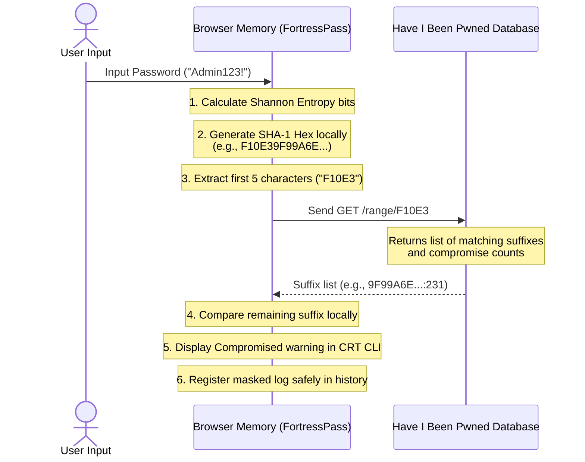

# 🛡️ FortressPass — High-Fidelity Cyber Security OS & Password Intelligence Dashboard

<p align="center">
  
</p>

<p align="center">
  
  
  
  
</p>

---

## 🌌 Overview

**FortressPass** is a premium, high-fidelity cybersecurity password analyzer and vulnerability intelligence dashboard. Far beyond standard visual strength bars, FortressPass implements real-time cryptographic algorithms, Have I Been Pwned breach checks with zero plain-text network leaks, computational brute-force simulators, and customizable passphrase generators.

Built with a gorgeous, fluid **Cyberpunk Glassmorphism** dark mode layout, this repository is optimized to showcase top-tier interactive coding practices, elite responsive CSS architecture, and advanced mathematics to potential recruiters and tech teams.

---

## 🚀 Key Features

*   **🔮 Cyberpunk Obsidian Theme:** Dynamic background meshes drifting over time, breathing ambient light orbs, and glassmorphic panels featuring translucent backdrops (`backdrop-filter`).
*   **📈 Reactive HSL Color System:** The entire application interface changes color states and glows according to password strength (Fragile 🔴, Weak 🟠, Moderate 🟡, Robust 🔵, Fortified 🟢).
*   **📐 Shannon Entropy Gauge:** A circular SVG dashboard charting mathematically computed bits of complexity:
    $$H = -\sum_{i=1}^{n} P(x_i) \log_2 P(x_i)$$
*   **⚡ HTML5 Physics Particle Backdrop:** Fully responsive constellation node web that drifts slowly in the background and gets pulled magnetically toward the user's cursor.
*   **🕵️ Have I Been Pwned k-Anonymity breach checking:** Fully implemented secure lookup protocol. Generates SHA-1 hash locally in the browser, queries HIBP using only the first 5 characters, and scans suffixes locally. *Your plain-text password never travels the wire.*
*   **📟 CRT Scanline retro hacking CLI:** Step-by-step console logging showing the live system processes, timestamps, encryption states, and a blinking cursor.
*   **🔐 Vault Simulator & Security Core:** Simulated biometric local vault where you can enroll passwords, test unlock timings, and visually observe lock/unlock/compromise security transitions.
*   **🧪 Cryptographic Hash Laboratory:** Real-time hash calculation utility featuring MD5, SHA-1, and SHA-256 with custom salt addition to see how salting alters final hashes.
*   **⚙️ Advanced Password Architect:** Standard random string engine paired with a customizable cyberpunk passphrase creator utilizing customized cyber word lists (e.g. `Neural-Vortex-Sync!1`).
*   **🎉 Copy Physics Confetti:** Celebrate generating or copying strong tokens with rich, custom canvas physics particle explosions blasting out from coordinates.

---

## 🔒 Security & System Architecture

The following data-flow diagram illustrates how FortressPass performs secure breach verifications without leaking plain-text information to any server:



---

## 🛠️ Technology Stack & Zero Dependencies

- **HTML5**: Custom SVG icons, semantic markup layouts.
- **CSS3 (Vanilla)**: Grid and Flexbox mechanics, keyframe animations, custom HSL color maps, CRT scanline mockups, and glassmorphic designs.
- **JavaScript (Vanilla ES6)**: Zero framework dependencies. High-performance custom canvas rendering, Web Crypto API integration, and multi-threaded Web Workers for background password cracking simulations.

---

## 📂 Project Structure

```
Pass-Strength-Analyzer/
├── assets/
│   ├── banner.png         # Main repository social banner
│   └── favicon.svg        # Cyber shield favicon
├── index.html             # Main HTML5 document and grid sections
├── style.css              # Cyberpunk CSS layout, animations, variables
├── app.js                 # App logic, Web Worker simulation, 3D visualizer
├── LICENSE                # Open-source MIT License
└── README.md              # Documentation
```

---

## 🚀 Quick Setup & Host Guide

Since FortressPass runs purely client-side, you don't need complex environments or server frameworks to deploy it.

### 1. Run Locally
```bash
# Clone the repository
git clone https://github.com/omkarmahadik96/Password-Strenght-Analyzer.git
cd Password-Strenght-Analyzer

# Open index.html directly in any modern browser!
# Or boot a lightning-fast python/node local server:
python -m http.server 8000
```
Open `http://localhost:8000` in your web browser.

### 2. Live Host (GitHub Pages)
You can deploy FortressPass to the web in less than 30 seconds for free:
1. Push your folder files to a public GitHub repository.
2. Navigate to **Settings** > **Pages** inside your repository.
3. Set the source to the `main` branch, click **Save**, and your live URL is active!

---

## 📜 License

Distributed under the open-source MIT License. See `LICENSE` for details.
